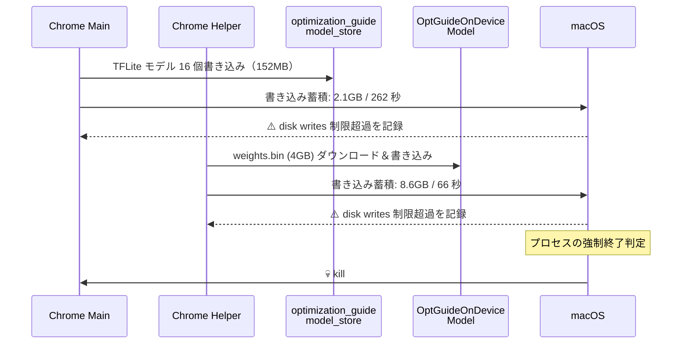

:::message
この記事で扱っている問題をワンコマンドで解決するスクリプトを公開した。依存ゼロ、やることは Enterprise Policy の設定とモデルデータの削除だけ。Chrome を終了してから実行する。

```bash
npx fix-chrome-diskwrite --full --opt-guide --schedule
```

ソースコード: https://github.com/kanketsu-jp/fix-chrome-diskwrite
:::

## TL;DR

:::message
**Chrome がたまに突然落ちる。新しいタブを開いたときに落ちることが多い。PC を買い替えても直らない。原因は何？**

→ **Chrome が裏でダウンロードする Gemini Nano（4GB の AI モデル）のディスク書き込みが、macOS のプロセス別書き込み制限を超過して、OS に強制終了されていた**

1. Chrome は v127 以降、**ユーザーの明確な同意なく** Gemini Nano の AI モデル（`weights.bin`, 4GB）をバックグラウンドでダウンロードする
2. macOS は各プロセスに 1 日あたりのディスク書き込み上限（約 2〜8GB）を設けている
3. Chrome の起動時やモデル更新時にこの制限を数分で使い切り、OS が Chrome を kill する
4. Enterprise Policy `GenAILocalFoundationalModelSettings=1` で確実に停止できる
5. Gemini Nano 以外のコンポーネント（ScreenAI、TTS 等）の書き込みでも制限超過する場合がある → `--full` オプションで対策可能
6. 一度クラッシュすると「起動 → セッション復元 → 再クラッシュ」のループに陥ることがある → `--fix-crash-loop` で修復可能
7. Chrome の対策を全て適用してもまだ落ちる場合、**Google Drive など他アプリが disk writes の制限を消費している**可能性がある
8. それでも落ちる場合、**拡張機能の競合**が原因の可能性がある（特に同種の拡張機能の重複インストール）
9. 一度クラッシュすると**キャッシュが壊れた状態で再起動**し、もっさりしたり再クラッシュする → `--schedule` の自動修復で対策可能
:::

## 背景

普段から LLM をローカルで動かしたり、Docker コンテナを 10 個以上同時に稼働させることがある。以前使っていた Mac ではメモリが足りなくなってきたので、48GB の MacBook Pro（M4 Pro）に買い替えた。

買い替え前の Mac でも Chrome はたまに落ちていたが、「まあメモリ不足かな」くらいに思っていた。ところが新しい Mac でも同じように Chrome が突然落ちる。環境をまっさらに構築し直したのに症状が同じということは、PC のスペックではなく **Chrome 自体に原因があるのでは？** と思い、調査してみた。

## 症状

体感としてはこう。

- Chrome を普通に使っていると、突然プロセスごと落ちる
- 特に**新しいタブを開いたとき**に起きやすい
- エラーメッセージは出ない。Chrome が一瞬で消える
- 再起動すれば普通に使える。しばらくするとまた落ちる

## macOS のクラッシュレポートを読む

macOS はプロセスがクラッシュしたとき、`/Library/Logs/DiagnosticReports/` にレポートを残す。Chrome 関連のレポートを確認した。

```bash
ls /Library/Logs/DiagnosticReports/ | grep "Google Chrome"
```

直近 3 日間で 5 件のレポートが見つかった。

### 全件が「disk writes」イベント

5 件すべてのレポートに共通していたのがこれ。

```
Event:            disk writes
Action taken:     none
Writes:           2147.49 MB of file backed memory dirtied over 262 seconds
                  (8198.28 KB per second average),
                  exceeding limit of 24.86 KB per second over 86400 seconds
```

メモリ不足でもなく、CPU 過負荷でもなく、**ディスク書き込み量の超過**。macOS が各プロセスに課しているディスク書き込みの上限を Chrome が突破して、OS 側が介入していた。

5 件の内訳はこう。

| 日時 | プロセス | 書き込み量 | 所要時間 | 書き込み速度 |
|------|---------|-----------|---------|------------|
| 3/5 15:23 | Main | 2.1 GB | 262 秒 | 8.2 MB/s |
| 3/5 15:24 | Helper | 8.6 GB | 66 秒 | **130 MB/s** |
| 3/5 16:10 | Helper | 2.1 GB | 624 秒 | 3.4 MB/s |
| 3/7 08:25 | Main | 8.6 GB | 13.3 時間 | 180 KB/s |
| 3/7 16:41 | Main | 2.1 GB | 68 分 | 522 KB/s |

2 件目の Helper プロセスが異常で、**66 秒で 8.6GB を 130MB/s で書き込んでいる**。

### スタックトレースの分析

クラッシュレポートにはスタックトレースも含まれている。全件で末端が `write` または `pwrite` システムコールで終わっていて、Chrome のストレージレイヤーからのディスク書き込みであることがわかる。

特に注目すべきは Report #1 のスタックトレースに `copyfile_internal` が含まれていたこと。**ファイルのコピー操作**が走っている。

```
7  copyfile + 3728 (libcopyfile.dylib + 6200)
7    copyfile_internal + 1020 (libcopyfile.dylib + 8416)
7      write + 8 (libsystem_kernel.dylib + 18164)
```

> 何のファイルをコピーしている？

## 犯人を特定する

Chrome のプロファイルディレクトリを調べた。

```bash
du -sh ~/Library/Application\ Support/Google/Chrome/*/
```

```
4.0G  OptGuideOnDeviceModel/
470M  Default/
456M  Profile 2/
152M  optimization_guide_model_store/
 33M  component_crx_cache/
...
```

**`OptGuideOnDeviceModel` が 4.0GB**。明らかに異常なサイズ。

中身を見る。

```bash
ls -lh ~/Library/Application\ Support/Google/Chrome/OptGuideOnDeviceModel/2025.8.8.1141/
```

```
  0B  adapter_cache.bin
  0B  encoder_cache.bin
247B  manifest.json
138B  on_device_model_execution_config.pb
4.0G  weights.bin     ← これ
```

`weights.bin` — 4GB の AI モデルの重みファイル。**Gemini Nano** のオンデバイスモデルだった。

### タイムスタンプが一致する

決定的だったのはファイルのタイムスタンプ。

```bash
stat -f "%Sm" ~/Library/Application\ Support/Google/Chrome/OptGuideOnDeviceModel/2025.8.8.1141/weights.bin
# Mar  5 15:24:27 2026
```

3/5 15:24 — これは**クラッシュレポート #2（Helper が 66 秒で 8.6GB を書いた）の時刻と完全に一致する**。

さらに `optimization_guide_model_store/` 以下のファイルも同じクラッシュ時間帯に 20 ファイル以上が一斉に書き込まれていた。

```bash
find ~/Library/Application\ Support/Google/Chrome/optimization_guide_model_store/ \
  -type f -newermt "2026-03-05 15:18:00" ! -newermt "2026-03-05 15:25:00" | wc -l
# 20
```

つまり Chrome 起動後の 7 分間で起きていたのはこう。



**7 分間で合計 ~14.8GB のディスク書き込み**。macOS の 1 日あたりの制限（2〜8GB）を一瞬で使い切っていた。

## 「新しいタブを開くと落ちる」の理由

新しいタブを開く操作自体が原因ではない。

Chrome はバックグラウンドで常にディスク書き込みを蓄積している。モデルのダウンロード、キャッシュの更新、各種ストレージへの書き込み。この蓄積が macOS の制限に近づいた状態で、新しいタブを開くとページ読み込みに伴う追加の書き込みが発生し、**制限を超えた瞬間に OS が Chrome を kill する**。

タブを開くのはトリガーであって、根本原因ではない。

## Optimization Guide / Gemini Nano とは

Chrome 127（2024 年）以降に導入されたオンデバイス AI 機能の基盤[^1]。

- **Gemini Nano**: Google の軽量 LLM。Chrome に組み込まれ、ローカルで推論を実行する
- **Optimization Guide**: ページ最適化の判定に使われる ML モデル群（TFLite 形式、16 個）
- **OptGuideOnDeviceModel**: Gemini Nano 本体（`weights.bin`, 4GB）

これらは `chrome://flags/#optimization-guide-on-device-model` で制御されるが、**デフォルトで有効**になっている場合がある。ユーザーに明確な同意を求めずにバックグラウンドでダウンロードされるため、多くのユーザーは気づかない[^2]。

### 自分だけの問題ではない

調べると世界中で同じ報告が上がっていた。

- 「C ドライブを圧迫していた原因が 4GB の weights.bin だった」[^3]
- 「Chrome が 4GB の Gemini Nano を許可なくダウンロードしている」[^4]
- 「削除しても Chrome が自動で復元する」[^2]
- Apple Community でも macOS 上の weights.bin の報告あり[^5]

ただし「macOS のディスク書き込み制限に引っかかってクラッシュする」というところまで原因を特定した報告は見つからなかった。多くの人は「Chrome がたまに落ちる」としか認識していない可能性がある。

## 対処法

### 0. ワンコマンドで対処する（推奨）

上記の原因と対処を 1 コマンドにまとめたスクリプトを公開している。Chrome を終了してから実行するだけ。

```bash
# 基本（Gemini Nano のみ）
npx fix-chrome-diskwrite

# フル対策（Gemini Nano 以外のコンポーネント書き込みも抑制）
npx fix-chrome-diskwrite --full --opt-guide --schedule
```

または Node.js がない環境:

```bash
curl -fsSL https://raw.githubusercontent.com/kanketsu-jp/fix-chrome-diskwrite/main/bin/fix.sh | bash -s -- --full --opt-guide --schedule
```

クラッシュループ（起動 → 即クラッシュを繰り返す）の修復:

```bash
npx fix-chrome-diskwrite --fix-crash-loop
```

元に戻す場合:

```bash
npx fix-chrome-diskwrite --undo --full --opt-guide --schedule
```

基本でやっていることは以下の 2 つ。

1. Chrome の公式 Enterprise Policy `GenAILocalFoundationalModelSettings=1` を設定（DL 禁止）
2. 既存のモデルデータを削除（約 4GB 解放）

`--full` を付けると、コンポーネント自動更新の停止、ScreenAI/TTS の無効化、Chrome 内蔵パスワードマネージャーの無効化、追加コンポーネントデータの削除も行う。Gemini Nano を止めてもまだ落ちる場合に有効（詳しくは「ちなみに、僕の場合」セクション参照）。

> ソースコード: https://github.com/kanketsu-jp/fix-chrome-diskwrite

### 1. chrome://flags で無効化する

削除しても Chrome が自動復元するため、**先に flags を無効化する**。

`chrome://flags` を開いて、以下の 2 つを **Disabled** に変更。

| フラグ | 設定 |
|--------|------|
| `#optimization-guide-on-device-model` | Disabled |
| `#prompt-api-for-gemini-nano` | Disabled |

変更後、Chrome を再起動（Relaunch）。

:::message alert
**注意:** `chrome://flags` の無効化だけでは不十分な場合がある。Web サイトが AI API（`Summarizer.create()` 等）を呼び出すだけでモデルが再ダウンロードされることが Chromium 開発者から報告されている[^7]。確実に止めるには Enterprise Policy（上記スクリプトが設定するもの）を使う。
:::

### 2. モデルファイルを削除する（4GB 回収）

Chrome を**完全に終了**してから実行。

```bash
rm -rf ~/Library/Application\ Support/Google/Chrome/OptGuideOnDeviceModel/
rm -rf ~/Library/Application\ Support/Google/Chrome/optimization_guide_model_store/
```

### 3. 無効化による影響

ほぼない。無効化されるのは以下の Chrome 内蔵 AI 機能のみ。

- 「Help me write」（テキストフィールドでの AI 文章作成支援）
- ページ要約などの AI 機能
- Web サイトが Chrome の Prompt API / Summarizer API を呼び出す機能

ChatGPT、Claude、Gemini など外部の AI サービスの利用には一切影響しない。

## ちなみに、僕の場合

普段から LLM をローカルで動かしたり、Docker コンテナを 10 個以上同時に立てたりしているので、Chrome が落ちたときは「まあメモリ足りないんだろうな」と思っていた。実際、以前使っていた Mac はメモリが厳しかったのでその認識は間違っていなかった。

問題は、48GB の MacBook Pro（M4 Pro）に買い替えてからも同じ症状が続いたこと。環境をまっさらに構築し直したのに、Chrome だけが突然落ちる。しかも新しいタブを開いたときに限って。「さすがに 48GB でメモリ不足はないだろう」と思ってクラッシュレポートを読み始めたのがきっかけだった。

対処後はどうなったかというと、**Chrome が落ちなくなった**。あたりまえだが、それまで「Chrome ってこういうものだろう」と思って受け入れていたので、落ちない Chrome がこんなに快適だとは思わなかった。

ディスク容量も約 4.2GB 回復した。weights.bin（4GB）と optimization_guide_model_store（152MB）を削除しただけ。使ってもいない AI モデルに SSD の容量を食われていたと思うと、なかなか腹立たしい。

### クラッシュループに陥った場合

ディスク書き込み超過で Chrome が一度クラッシュすると、Preferences に `exit_type: Crashed` が記録される。次回起動時に Chrome は前回のセッション（大量のタブや Google Meet 等）を一斉に復元しようとし、その負荷で再びクラッシュする。結果として「起動 → セッション復元 → クラッシュ → 起動 → …」のループに陥る。

自分も実際にこの状態になった。Chrome を再起動しても、新しいタブを開こうとした瞬間に落ちる。何度やっても同じ。

修復方法は 2 つ。

**A. スクリプトで修復する（推奨）**

```bash
npx fix-chrome-diskwrite --fix-crash-loop
```

これは以下を行う。

1. Preferences の `exit_type` を `Crashed` → `Normal` にリセット
2. 破損したセッションファイル（`Sessions/Session_*`, `Sessions/Tabs_*`）をバックアップして削除

修復後、Chrome は空の新しいタブで起動する。以前のタブは `chrome://history` から個別に復元できる。

**B. 手動で修復する**

Chrome を完全に終了してから以下を実行する。

```bash
# exit_type をリセット
python3 -c "
import json
p = '$HOME/Library/Application Support/Google/Chrome/Default/Preferences'
with open(p) as f: d = json.load(f)
d['profile']['exit_type'] = 'Normal'
d['profile']['exited_cleanly'] = True
with open(p, 'w') as f: json.dump(d, f)
"

# セッションファイルを削除（バックアップ推奨）
rm -f ~/Library/Application\ Support/Google/Chrome/Default/Sessions/Session_*
rm -f ~/Library/Application\ Support/Google/Chrome/Default/Sessions/Tabs_*
```

:::message alert
**注意:** クラッシュループの修復はあくまで応急処置。根本原因（ディスク書き込み超過）を解消しないと再発する。`--fix-crash-loop` と `--full --opt-guide --schedule` を併用するのがベスト。
:::

### Gemini Nano を止めてもまだ落ちるケース

ちなみに、Gemini Nano を止めた後も Chrome が落ち続けるケースがあった。自分の環境がまさにそれだった。

Gemini Nano の対策（`GenAILocalFoundationalModelSettings=1` + モデル削除）を適用した後も、Chrome を開いて数分で「パッ」と消える。クラッシュレポートを見ると、やはり `disk writes` で kill されている。

```
Event:            disk writes
Writes:           2147.65 MB of file backed memory dirtied over 768 seconds
                  (2797.07 KB per second average),
                  exceeding limit of 24.86 KB per second over 86400 seconds
```

スタックトレースも同じく `copyfile` → `write`。Gemini Nano は止めたのに、**別の書き込みが 2.1GB を超えている**。

調べてみると、Chrome は Gemini Nano 以外にもディスクに書き込むコンポーネントが大量にある。

| コンポーネント | サイズ | 内容 |
|---|---|---|
| `screen_ai/` | 123 MB | OCR/アクセシビリティ AI モデル |
| `component_crx_cache/` | 157 MB | コンポーネント更新キャッシュ |
| `WasmTtsEngine/` | 22 MB | テキスト読み上げエンジン |
| `GraphiteDawnCache/` | 13 MB | GPU シェーダーキャッシュ |
| `BrowserMetrics/` | 8 MB | 利用統計 |
| `optimization_guide_model_store/` | 55 MB | 最適化用モデル（再生成される） |

単体では大きくないが、Chrome はこれらを起動時にまとめて更新・再生成する。3 つのプロファイルを使っていた場合、プロファイルごとにデータが生成されるので書き込み量は 3 倍になる。これが Gemini Nano なしでも macOS の 2GB 制限を超える要因だった。

さらに別のクラッシュも見つかった。macOS の `SafariPlatformSupport.Helper` が Chrome の AutoFill 機能と連携する際にメモリ上限（15MB）を超えて OS に kill され、Chrome が連鎖的にクラッシュするというもの。

```
process com.apple.Safari [99432] crossed memory high watermark (15 MB); EXC_RESOURCE
```

1Password を使っていて Chrome 内蔵のパスワードマネージャーを使っていない場合、Chrome 内蔵の AutoFill を無効化することでこのクラッシュも防げる。1Password の拡張機能には影響しない。

これらの追加対策を `--full` オプションとして fix-chrome-diskwrite v2.0.0 に組み込んだ。

```bash
npx fix-chrome-diskwrite --full --opt-guide --schedule
```

`--full` が適用するポリシーは以下。

| ポリシー | 値 | 効果 |
|---|---|---|
| `ComponentUpdatesEnabled` | false | コンポーネント自動更新停止 |
| `ScreenAIEnabled` | false | ScreenAI 無効化 |
| `TextToSpeechEnabled` | false | TTS 無効化 |
| `BackgroundModeEnabled` | false | バックグラウンド書き込み防止 |
| `PasswordManagerEnabled` | false | 内蔵パスワードマネージャー無効化 |
| `AutofillAddressEnabled` | false | 住所自動入力無効化 |
| `AutofillCreditCardEnabled` | false | クレジットカード自動入力無効化 |
| `DiskCacheSize` | 52428800 | HTTP キャッシュ上限を 50MB に制限 |
| `MediaCacheSize` | 33554432 | メディアキャッシュ上限を 32MB に制限 |

加えて `screen_ai/`、`WasmTtsEngine/`、`component_crx_cache/`、`GraphiteDawnCache/`、`BrowserMetrics/` と `~/Library/Caches/Google/Chrome/` を削除する。

### さらに落ちるケース: ブラウザキャッシュ

`--full` を適用しても、macOS 再起動直後にクラッシュするケースがあった。調べると `~/Library/Application Support/Google/Chrome/` とは**別の場所**にブラウザキャッシュが存在していた。

```bash
du -sh ~/Library/Caches/Google/Chrome/
# 4.2G
```

`~/Library/Caches/Google/Chrome/` に HTTP キャッシュ（`Cache/`）と JavaScript コンパイルキャッシュ（`Code Cache/`）が格納されており、プロファイルごとに 1〜2GB になっていた。Chrome 起動時にこれらの読み書きが disk writes カウンタに加算される。

この場所は `Application Support` 配下ではないため、今まで見落としていた。v3.0.0 でこのキャッシュの削除も `--full` と定期クリーンアップの対象に追加した。

削除しても履歴・ブックマーク・パスワード等には影響しない。Web サイトの読み込みが一時的に遅くなるだけで、アクセスすれば自動で再キャッシュされる。

適用後、Chrome が落ちなくなった。

### クラッシュ後にもっさりするケース: キャッシュ破損

Chrome がクラッシュすると、キャッシュファイルが中途半端な状態で残る。次回起動時に Chrome がこれらの壊れたファイルを読もうとして `Cannot stat` エラーが大量に発生し、**ブラウザ全体がもっさりする**。さらに悪化するとクラッシュ→壊れたキャッシュで再起動→再クラッシュのループに陥る。

`--opt-guide --schedule` を指定すると、2 分ごとに実行される LaunchAgent がこれを自動修復する。

- **Chrome 未起動時**: `exit_type=Crashed` を検知したら壊れたキャッシュ（HTTP Cache、Code Cache、Service Worker CacheStorage、DawnWebGPUCache 等）を自動削除 + `exit_type` を `Normal` にリセット
- **Chrome 起動中**: `exit_type` のリセットのみ（キャッシュは触らない）

:::message alert
**重要:** Chrome 起動中にキャッシュを削除してはいけない。Chrome のメモリ上のキャッシュインデックスと実ファイルが不整合になり、逆に `Cannot stat` エラーが増える。キャッシュの修復は必ず Chrome 未起動時に行う。
:::

### それでもまだ落ちるケース: Google Drive

ここまでの対策を全て適用しても、まだ Chrome が落ちるケースがあった。Activity Monitor を確認すると、Chrome の Bytes Written は 504.7MB なのに対し、**Google Drive が 11.88GB** を書き込んでいた。

クラッシュレポートにも Google Drive が `disk writes` 制限を超過した記録があった。

```
Command:          Google Drive
Event:            disk writes
Writes:           8589.94 MB of file backed memory dirtied over 69133 seconds
```

19 時間で 8.6GB。Chrome の対策で Chrome 自体の書き込みは 500MB 程度に抑えられていたが、**Google Drive が同じ macOS の書き込みバジェットを食い尽くしていた**。

プロセスごとの書き込み量を `proc_pid_rusage` API で調べた結果がこれ。

| プロセス | logical_writes | 制限消費率 |
|---|---|---|
| **fileproviderd** | **16.76 GB** | **799%** |
| Figma | 2.15 GB | 103% |
| Google Chrome | 454.8 MB | **21%** |

`fileproviderd` は macOS が Google Drive のストリーミングモードを管理するシステムプロセス。Google Drive アプリを終了しても、macOS の `fileproviderd` はバックグラウンドで動き続ける。**Chrome の書き込みは全体のわずか 1.3% だった**。

> でも、なんでストリーミングモードなのに 16GB も書き込む？

Google Drive の設定を確認すると、既にストリーミングモード（ミラーリングではない）だった。原因は**共有ドライブの数**。15 個以上の共有ドライブが登録されており、それぞれのメタデータ同期が常時走っていた。さらに 2 アカウント分なので書き込みは倍になる。

対策として Google Drive の「Manage shared drives」で使っていない共有ドライブの同期を OFF にし、最終的に Google Drive アプリ自体をアンインストールした。結果、書き込み速度が **55.4 MB/s → 865 KB/s（1/64）** に激減した。

:::message alert
**Google Drive を使っている場合の注意:** Chrome の disk writes 対策を全て適用してもまだ落ちる場合、Activity Monitor の Disk タブで Google Drive の Bytes Written を確認すること。ストリーミングモードでも、共有ドライブが多いと macOS の `fileproviderd` が大量の書き込みを行う。
:::

### それでもまだ落ちるケース: 拡張機能の競合

上記の対策を全て適用し、Google Drive も対処済みなのにまだ落ちるケースがあった。

詳細なログ調査（Chrome `--enable-logging=stderr --v=2` で 34,000 行以上、macOS system log、プロセス監視）を行った結果、Chrome は FATAL エラーもシグナルもカーネル kill もなく**無言で消えていた**。Crashpad にもダンプが生成されない。

切り分けのために Enterprise Policy を全て削除しても変わらず。しかし**拡張機能を整理したところクラッシュが止まった**。その後 Policy を全件復元しても安定動作。

犯人の特定には至らなかったが、最も疑わしいのは以下。

- **不明な拡張機能**（Chrome Web Store に存在しない ID が両プロファイルにインストールされていた）
- **Adobe Acrobat** — 全ページで content script を注入し、起動直後に 12MB の書き込みを行う
- **正体不明の拡張機能**（Chrome Web Store に存在しない ID）— 両プロファイルにインストールされていた

:::message
**拡張機能を整理するときのポイント:**

- 同じ機能の拡張機能を複数入れない
- 使っていない拡張機能は削除する
- 「拡張機能をクリックしたとき」モードに変更できるものは変更する（全ページでの content script 注入を防げる）
- Chrome Web Store に存在しない拡張機能がインストールされていたら削除する
:::

## もうちょっと深掘ってみた

ここからは macOS のディスク書き込み制限の仕組みと、なぜ Chrome がこの制限に引っかかりやすいのかを掘り下げる。

### macOS の disk writes 制限

macOS は各プロセスに対して、一定期間内のディスク書き込み量に上限を設けている。クラッシュレポートから読み取れた制限値は以下。

| 制限タイプ | 書き込み上限 | 期間 | 速度換算 |
|-----------|------------|------|---------|
| 通常プロセス | 2,147.48 MB（≒ 2GB） | 86,400 秒（24 時間） | 24.86 KB/s |
| 高負荷プロセス | 8,589.93 MB（≒ 8GB） | 86,400 秒（24 時間） | 99.42 KB/s |

この制限はプロセス単位で適用される。Chrome はマルチプロセスアーキテクチャのため、Main プロセスと Helper プロセスそれぞれに制限がかかる。3/5 のクラッシュでは Main と Helper の両方が別々に制限を超過していた。

### クラッシュレポートの「Action taken: none」

全件で `Action taken: none` となっている。これは macOS がプロセスを直接 kill したわけではなく、書き込み制限超過を**記録**したことを意味する。実際のクラッシュは、この記録とほぼ同時に発生する resource exception として処理される。

### なぜ起動直後に発生するのか

3/5 のクラッシュは PC 起動後わずか 19 分で発生していた。

```
Time Since Boot:  1154s    ← 19 分
```

Chrome の Optimization Guide は起動時にモデルの状態をチェックし、必要に応じてダウンロード・更新する。新しい PC の場合や Chrome の更新後は、全モデルのダウンロードが一斉に走る。この初回ダウンロードの書き込み量が最も大きく、制限超過が起きやすい。

### 夜間の長時間稼働でも発生する

3/7 のクラッシュは 13 時間にわたる書き込み蓄積で発生していた。

```
Writes: 8589.95 MB of file backed memory dirtied over 47844 seconds
        (179.54 KB per second average)
```

書き込み速度は 180 KB/s と低いが、13 時間の積算で 8.6GB に到達。Chrome を開いたまま放置していても、バックグラウンドのストレージ操作が積み重なって制限に達する。

### メモリ使用量の変化

クラッシュレポートの Footprint（メモリ使用量）を見ると、クラッシュ前にメモリが急増している。

```
Footprint: 237.78 MB -> 389.69 MB (+151.91 MB) (max 412.05 MB)
```

約 150MB の増加。これは Gemini Nano のモデルをメモリにロードする際の増分と考えられる。48GB のマシンでは問題にならないが、ディスク書き込みは別の話。

## まとめ

:::message
**最重要ポイント:**

1. Chrome が落ちる原因は**メモリ不足ではなく、ディスク書き込み量の制限超過**だった
2. 犯人は Chrome に同梱される **Gemini Nano の AI モデル**（4GB の `weights.bin`）
3. Enterprise Policy `GenAILocalFoundationalModelSettings=1` で確実に停止できる
4. 一度クラッシュすると **セッション復元によるクラッシュループ** に陥ることがある → `--fix-crash-loop` で修復
5. クラッシュ後は**キャッシュが壊れてもっさりする** → `--schedule` の 2 分間隔自動修復で対策
6. Chrome の対策を全て適用しても落ちる場合、**Google Drive など他アプリの書き込み**が macOS の制限を消費している可能性がある
7. それでも落ちる場合、**拡張機能の競合**（同種拡張の重複、corrupted 状態）が原因の可能性がある
8. この問題は自分固有ではなく、世界中で報告されている
:::

同じ症状で悩んでいる方の参考になれば。

## 参考文献

[^1]: [Get started with built-in AI | Chrome for Developers](https://developer.chrome.com/docs/ai/get-started)
[^2]: [I found a 4GB "weights.bin" file on Windows 11 – here's how I stopped Chrome from reinstalling it without your consent](https://pureinfotech.com/stop-chrome-gemini-nano-download-windows-11/)
[^3]: [Zephyrianna (@zephyrianna) - X](https://x.com/zephyrianna/status/2024962946598949214)
[^4]: [Google Chrome Downloads 4 GB Gemini Nano Model Without User Prompt](https://pbxscience.com/google-chrome-downloads-4-gb-gemini-nano-model-without-user-prompt/)
[^5]: [the file weight.bin located under Library… - Apple Community](https://discussions.apple.com/thread/255818960)
[^6]: [GenAILocalFoundationalModelSettings - Chrome Enterprise Policy](https://chromeenterprise.google/policies/#GenAILocalFoundationalModelSettings)
[^7]: [How to disable the browser from downloading model files - Chromium Dev Group](https://groups.google.com/a/chromium.org/g/chrome-ai-dev-preview-discuss/c/t6fqOnTzA_g)
[^8]: [Chrome downloaded OptGuideOnDeviceModel without consent - GitHub](https://github.com/lgarron/first-world/issues/239)
[^9]: [Removing the model can leave browser in a weird state - Chromium Dev Group](https://groups.google.com/a/chromium.org/g/chrome-ai-dev-preview-discuss/c/P0BqeB53e6g)
